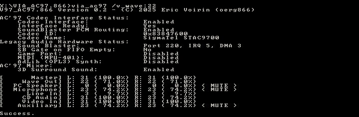

# VIA_AC97.866

(C) 2025 Eric Voirin (oerg866)

---

# Description

**VIA_AC97.866** is a driver and mixer configuration program for MS-DOS that lets you configure Legacy Audio features of VIA motherboard south bridges, found on many old VIA-based motherboards in the late 1990s and early 2000s.

These chipsets have hardware-based legacy audio support, with lackluster and barely functional vendor-provided drivers.

VIA_AC97.866 does not need a TSR to enable basic Sound Blaster, MIDI and Game Port functionality.

In addition, this program lets you change the volume mixer settings, which the VIA drivers do not support.

Without parameters, it uses the values configured by the BIOS and only powers up and unmutes the audio codec.

Additional configuration can be done using command line parameters.

**VIA_AC97.866** was built using the [LIB866D DOS Real-Mode Software Development Library](https://github.com/oerg866/lib866d)

# Features:

- [x] Set up AC97 audio codec
- [x] Configure Sound Blaster Legacy Audio
    - Enable/Disable
    - Port
    - IRQ
    - DMA
- [x] Configure MIDI (MPU-401) Port
    - Enable/Disable
    - Port
- [x] Configure Game Port
- [x] Enable/Disable VIA OPL3 TSR support
- [x] Override BIOS configuration
    - Can help with poor BIOS implementations
- [x] Mixer volume settings
    - Master Volume
    - Wave Out
    - PC Speaker
    - Microphone
    - Line In
    - CD Audio
    - Video In
    - Auxiliary
- [x] Enable/Disable "3D Surround Sound"
- [x] Enable/Disable Microphone 20dB Boost

# Supported VIA Chipset Southbridges

* VT82C686
* VT82C686A
* VT82C686B

These are found on many old Pentium 1/2/3 and Athlon/Duron motherboards, so you may be in luck!

# Running the Driver

`VIA_AC97.EXE <parameters>`

## Command Line

VIA_AC97.866 supports the following command line parameters:

| Argument | Description |
| -------- | ------- |
| `/sb:<port>,<irq>,<dma>`  | Enable Sound Blaster |
|                           | `port`: I/O Port (0x220, 0x240, 0x260, 0x280) |
|                           | `irq`: IRQ (5, 7, 9, 10) |
|                           | `dma`: DMA channel (0, 1, 2 ,3) |
|                           | Example: `/sb:0x220,5,1` |
| `/nosb`                   | Force Disable Sound Blaster |
| `/midi:<port>`            | Enable MIDI Port |
|                           | `port`: I/O Port (0x300, 0x310, 0x320, 0x330) |
| `/nomidi`                 | Force Disable MIDI Port |
| `/fm:<0/1>`               | Disable/Enable Adlib/OPL3 (Always hardcoded to port 0x388!) |
|                           | *NOTE: This just sets a flag to enable  H/W Assistance for OPL3 emulation. It requires VIAFMTSR.EXE to function!* |
| `/joy:<0/1>`              | Disable/Enable Game Port (Always hardcoded to port 0x201!) |
| `/v_master:<volume>`      | Mixer: Set Master Volume (0-31) |
| `/v_wave:<volume>`        | Mixer: Set Wave Volume (0-31) |
| `/v_pcspk:<volume>`       | Mixer: Set PC Speaker Volume (0-15) |
| `/v_mic:<volume>`         | Mixer: Set Mic Volume (0-31) |
| `/v_cd:<volume>`          | Mixer: Set CD Audio Volume (0-31) |
| `/v_video:<volume>`       | Mixer: Set Video Volume (0-31) |
| `/v_aux:<volume>`         | Mixer: Set Auxiliary Volume (0-31) |
| `/micbooost:<0/1>`        | Disable/Enable 20dB Mic Boost |
| `/3d:<0/1>`               | Disable/Enable '3D Surround Sound' |

# Building **VIA_AC97.866**

* Install OpenWatcom and set up the default environment as described in its README.
* Run `wmake` in the repository folder
* That's it!

# License

[Creative Commons Attribution-NonCommercial-ShareAlike 4.0 (CC BY-NC-SA 4.0)](https://creativecommons.org/licenses/by-nc/4.0/deed.en)
